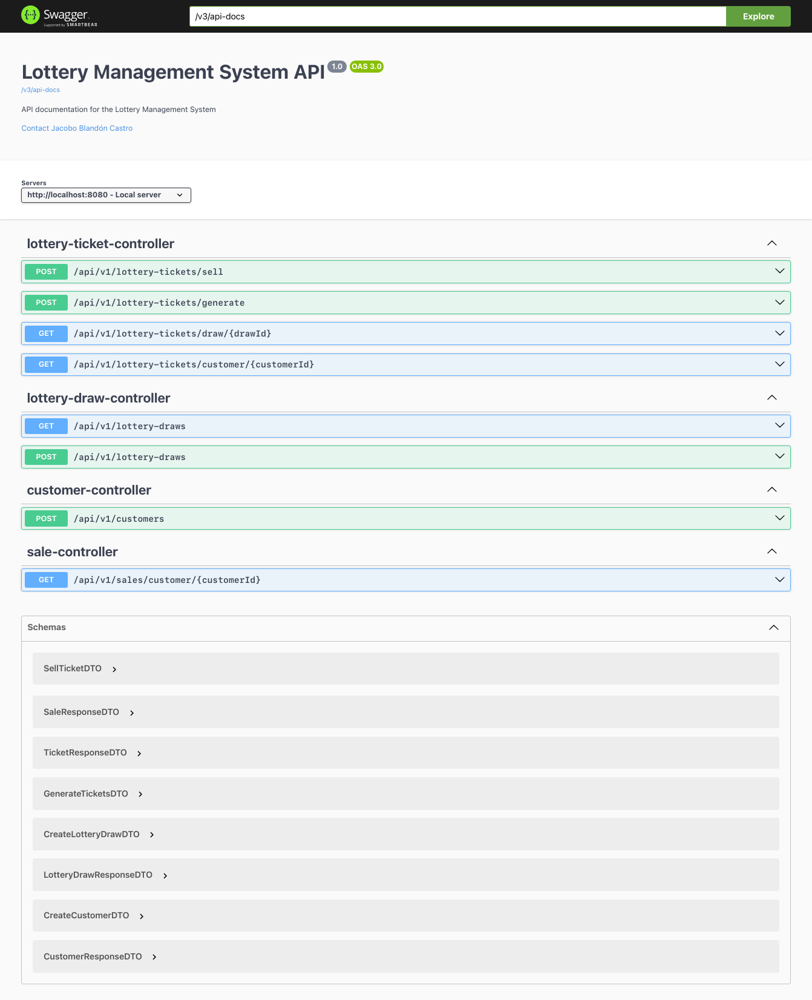
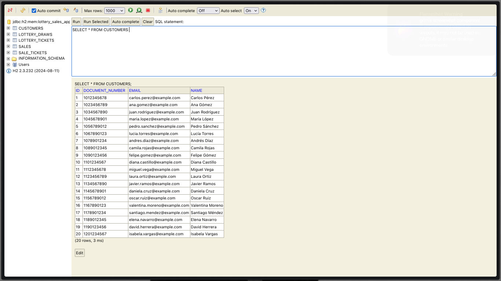

# Backend - Lottery Sales App

API REST para la gestión de **ventas de lotería**, desarrollada con **Spring Boot** siguiendo los principios de **Clean Architecture**.

---

## Tabla de Contenido

- [Backend - Lottery Sales App](#backend---lottery-sales-app)
  - [Tabla de Contenido](#tabla-de-contenido)
  - [Descripción general](#descripción-general)
  - [Estructura del proyecto](#estructura-del-proyecto)
  - [Tecnologías utilizadas](#tecnologías-utilizadas)
  - [Base de datos H2](#base-de-datos-h2)
  - [Datos de ejemplo](#datos-de-ejemplo)
  - [Endpoints Disponibles](#endpoints-disponibles)
  - [Ejecución de la aplicación](#ejecución-de-la-aplicación)
  - [Ejecución de pruebas](#ejecución-de-pruebas)
  - [Previsualizaciones](#previsualizaciones)
    - [Swagger UI](#swagger-ui)
    - [H2 Console](#h2-console)

---

## Descripción general

Sistema básico para la venta de billetes de lotería, el cual permite:

- Registrar clientes.
- Crear y listar sorteos.
- Crear billetes asociados a sorteos.
- Vender billetes a clientes.
- Consultar ventas realizadas.

---

## Estructura del proyecto

El proyecto sigue la arquitectura limpia, dividiendo el código en capas:

```bash
backend/
├── src/
│   ├── main/
│   │   ├── java/com/blandev/lottery/backend/
│   │   │   ├── application/
│   │   │   │   ├── dto/ # DTOs para transferencia de datos
│   │   │   │   ├── mapper/ # Mapeadores entre entidades y DTOs
│   │   │   │   ├── usecase/ # Casos de uso de la aplicación
│   │   │   ├── domain/
│   │   │   │   ├── exception/ # Excepciones del dominio
│   │   │   │   ├── model/ # Modelos del dominio
│   │   │   │   ├── repository/ # Interfaces de repositorio
│   │   │   ├── infrastructure/
│   │   │   │   ├── config/ # Configuraciones de Spring
│   │   │   │   ├── persistence/
│   │   │   │   │   ├── adapter/ # Adaptadores de persistencia
│   │   │   │   │   ├── entity/ # Entidades JPA
│   │   │   │   │   ├── mapper/ # Mapeadores de entidades
│   │   │   │   │   ├── repository/ # Implementaciones de repositorios
│   │   │   │   ├── web/
│   │   │   │   │   ├── controller/ # Controladores REST
│   │   │   │   │   ├── exception/ # Manejadores de excepciones
│   │   ├── resources/
│   │   │   ├── application.properties # Configuraciones de la aplicación
│   │   │   ├── data.sql # Datos iniciales para la base de datos
│   │   │   ├── schema-demo.sql # Esquema de la base de datos
│   ├── tests/
│       ├── ... (test unitarios)
├── pom.xml
```

--- 

## Tecnologías utilizadas

**Lenguaje y Framework**
- Java 17
- Spring Boot 3

**Persistencia y Base de Datos**
- Spring Data JPA
- H2 Database (base de datos en memoria para desarrollo y pruebas)

**Documentación y Validación**
- Swagger/OpenAPI
- Spring Validation

**Testing**
- JUnit 5
- Mockito
- Spring Boot Test

---

## Base de datos H2

La aplicación utiliza una base de datos en memoria H2 para facilitar el desarrollo y las pruebas. La configuración de la base de datos se encuentra en el archivo `application.properties`.

Para acceder a la consola de H2, puedes dirigirte a: `http://localhost:8080/h2-console` después de iniciar la aplicación. Usa las siguientes credenciales por defecto:

- **JDBC URL:**  `jdbc:h2:mem:lottery_sales_app_db`
- **Username:** `sa`
- **Password:** (dejar en blanco)

Aquí puedes ejecutar consultas SQL directamente contra la base de datos en memoria, así como inspeccionar las tablas y datos creados durante la ejecución de la aplicación.

---

## Datos de ejemplo

El archivo `data.sql` contiene datos de ejemplo que se cargan automáticamente al iniciar la aplicación. Estos datos incluyen clientes, sorteos, billetes y ventas para facilitar las pruebas iniciales de la API.

También se encuentra el archivo `schema-demo.sql` que define el esquema de la base de datos utilizado en la aplicación. En este caso, no se utiliza explícitamente, ya que JPA genera las tablas automáticamente, pero está disponible para referencia o modificaciones futuras.

---

## Endpoints Disponibles

- `POST /api/v1/customers` - Crear un nuevo cliente.
- `POST /api/v1/lottery-draws` - Crear un nuevo sorteo de lotería.
- `GET /api/v1/lottery-draws` - Listar todos los sorteos de lotería.
- `POST /api/v1/lottery-tickets/generate` - Generar billetes para un sorteo específico.
- `POST /api/v1/lottery-tickets/sell` - Vender billetes a un cliente.
- `GET /api/v1/lottery-tickets/draw/{drawId}` - Listar billetes de un sorteo específico.
- `GET /api/v1/lottery-tickets/customer/{customerId}` - Listar billetes vendidos a un cliente específico. 
- `GET /api/v1/sales/customer/{customerId}` - Consultar ventas realizadas a un cliente específico.

Para consultar los endpoints disponibles y su documentación, puedes acceder a Swagger UI en: `http://localhost:8080/swagger-ui.html` después de iniciar la aplicación.

Aquí encontrarás una lista completa de los endpoints REST, junto con detalles sobre los parámetros de entrada, respuestas esperadas y posibles códigos de estado HTTP.

---

## Ejecución de la aplicación

Para ejecutar la aplicación localmente sin hacer uso del frontend, sigue estos pasos:

1. Clona el repositorio.

    ```bash
    git clone git@github.com:blandoncj/lottery-sales-app.git
    cd lottery-sales-app/backend
    ```

2. Asegúrate de tener Java 17 y Maven instalados en tu máquina.

3. Construye el proyecto utilizando Maven.

    ```bash
    mvn clean install
    ```

4. Ejecuta la aplicación.

    ```bash
    mvn spring-boot:run
    ```

5. La aplicación estará disponible en `http://localhost:8080`.

6. Accede a Swagger UI para explorar los endpoints: `http://localhost:8080/swagger-ui.html`.

---

## Ejecución de pruebas
Para ejecutar las pruebas unitarias, utiliza el siguiente comando:

```bash
mvn test
```

---

## Previsualizaciones

### Swagger UI



### H2 Console

