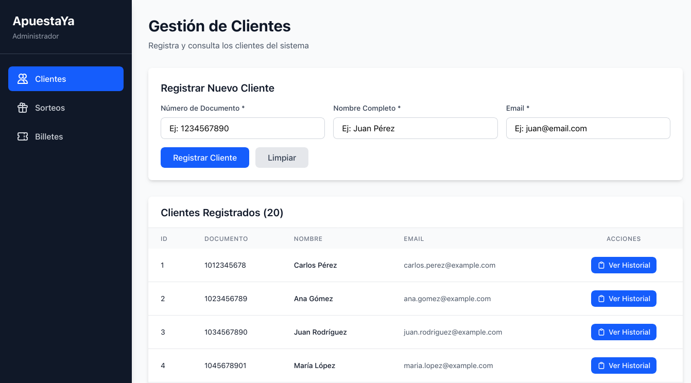
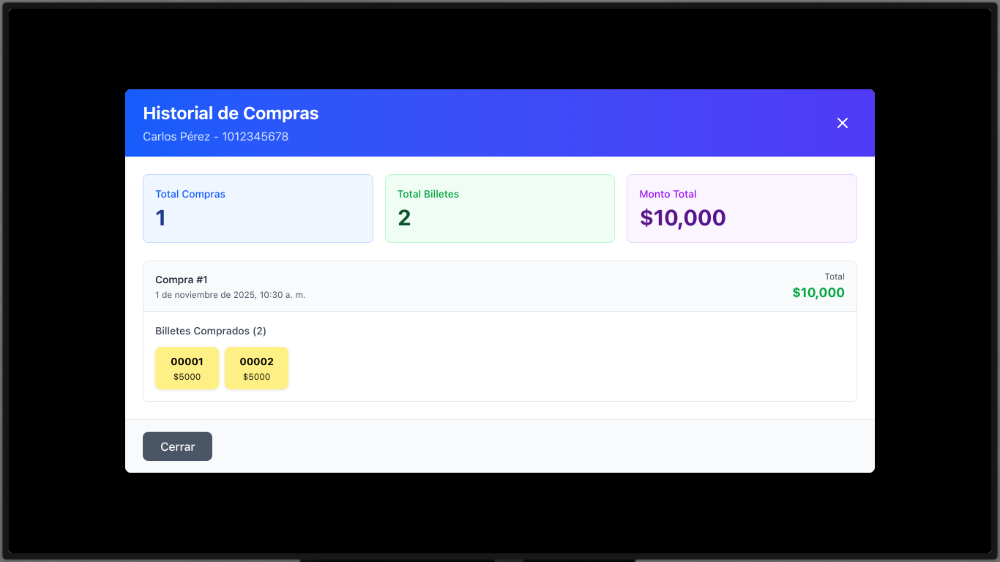
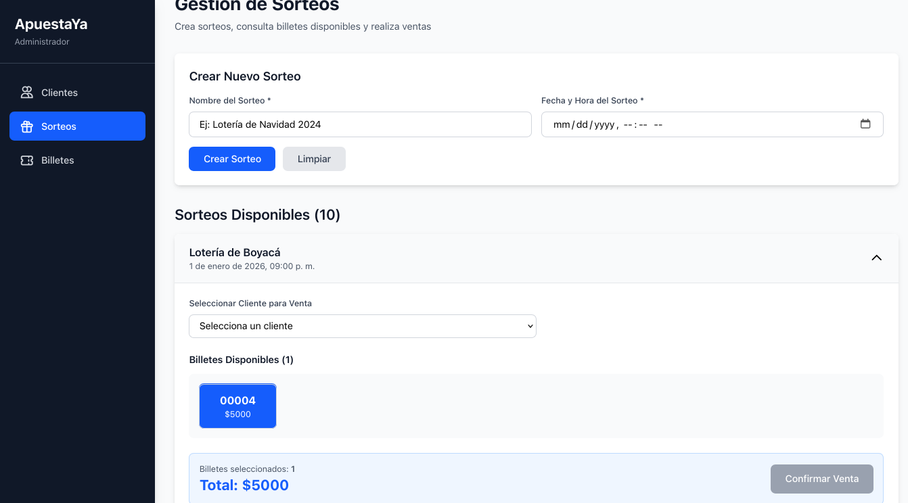
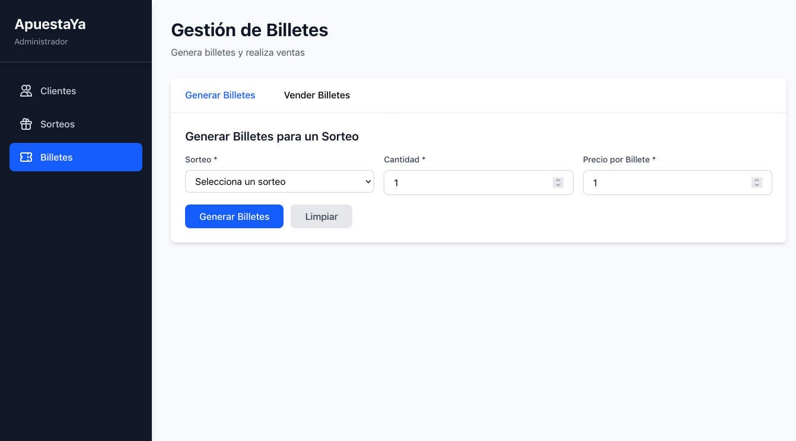

# Frontend - Lottery Sales App

Aplicación web desarrollada con **Angular** para la gestión de **ventas de lotería**. Interfaz de usuario moderna y responsiva que consume la API REST del backend.

---

## Tabla de Contenido

- [Frontend - Lottery Sales App](#frontend---lottery-sales-app)
  - [Tabla de Contenido](#tabla-de-contenido)
  - [Descripción general](#descripción-general)
  - [Características](#características)
  - [Estructura del proyecto](#estructura-del-proyecto)
  - [Tecnologías utilizadas](#tecnologías-utilizadas)
  - [Requisitos previos](#requisitos-previos)
  - [Instalación](#instalación)
  - [Configuración](#configuración)
  - [Ejecución de la aplicación](#ejecución-de-la-aplicación)
  - [Ejecución de pruebas](#ejecución-de-pruebas)
  - [Build para producción](#build-para-producción)
  - [Módulos y funcionalidades](#módulos-y-funcionalidades)
    - [Clientes](#clientes)
    - [Sorteos](#sorteos)
    - [Billetes](#billetes)
    - [Ventas](#ventas)
  - [Previsualizaciones](#previsualizaciones)
    - [Página de Clientes](#página-de-clientes)
    - [Página de Sorteos](#página-de-sorteos)
    - [Modal de Historial de Compras](#modal-de-historial-de-compras)

---

## Descripción general

Aplicación frontend que permite gestionar de manera intuitiva y visual:

- ✅ Registro y consulta de clientes
- ✅ Creación y listado de sorteos
- ✅ Generación automática de billetes
- ✅ Venta de billetes a clientes
- ✅ Consulta de historial de ventas
- ✅ Visualización de estadísticas en tiempo real

---

## Características

- **Diseño moderno** con Tailwind CSS
- **Actualizaciones en tiempo real** mediante observables RxJS
- **Clean Architecture** - Separación clara de responsabilidades

---

## Estructura del proyecto

```bash
frontend/
├── src/
│   ├── app/
│   │   ├── core/                      # Núcleo de la aplicación
│   │   │   ├── models/                # Modelos e interfaces
│   │   │   │   ├── customer.model.ts
│   │   │   │   ├── lottery-draw.model.ts
│   │   │   │   ├── lottery-ticket.model.ts
│   │   │   │   └── sale.model.ts
│   │   │   ├── services/              # Servicios HTTP
│   │   │       ├── customer/
│   │   │       │   └── customer.service.ts
│   │   │       ├── lottery-draw/
│   │   │       │   └── lottery-draw.service.ts
│   │   │       ├── ticket/
│   │   │       │   └── ticket.service.ts
│   │   │       └── sale/
│   │   │          └── sales.service.ts
│   │   │
│   │   ├── features/                  # Módulos por funcionalidad
│   │   │   ├── customers/
│   │   │   │   ├── customers.component.ts
│   │   │   │   ├── customers.component.html
│   │   │   │   └── customers.component.css
│   │   │   ├── lottery-draws/
│   │   │   │   ├── lottery-draws.component.ts
│   │   │   │   ├── lottery-draws.component.html
│   │   │   │   └── lottery-draws.component.css
│   │   │   ├── lottery-tickets/
│   │   │       ├── tickets.component.ts
│   │   │       ├── tickets.component.html
│   │   │       └── tickets.component.css
│   │   │
│   │   ├── shared/                    # Componentes compartidos
│   │   │   └── components/
│   │   │       └── sidebar/
│   │   │
│   │   ├── app-routing.module.ts      # Rutas principales
│   │   ├── app.ts
│   │   └── app.config.ts
│   │
│   │
│   ├── environments/                  # Configuraciones de entorno
│   │   ├── environment.ts             # Desarrollo
│   │   └── environment.prod.ts        # Producción
│   │
│   ├── styles.css                     # Estilos globales
│   └── index.html
│
├── angular.json
├── package.json
├── tailwind.config.js
└── tsconfig.json
```

---

## Tecnologías utilizadas

**Framework y Lenguaje**

- Angular 18+
- TypeScript 5+

**Estilos**

- Tailwind CSS 3+

**Gestión de Estado y Datos**

- RxJS 7+ (Observables, Subjects)
- Angular Forms (Template-driven y Reactive)

**HTTP y Comunicación**

- HttpClient

**Herramientas de Desarrollo**

- Angular CLI
- npm / yarn

---

## Requisitos previos

Asegúrate de tener instalado:

- **Node.js** (v18 o superior)
- **npm** (v9 o superior) o **yarn**
- **Angular CLI** (v18 o superior)

```bash
# Verificar versiones
node --version
npm --version
ng version
```

Si no tienes Angular CLI instalado:

```bash
npm install -g @angular/cli
```

---

## Instalación

1. **Clona el repositorio**

```bash
    git clone git@github.com:blandoncj/lottery-sales-app.git
    cd lottery-sales-app/frontend
```

2. **Instala las dependencias**

```bash
    npm install
```

O con yarn:

```bash
    yarn install
```

---

## Configuración

**Configurar URL del backend**

Edita el archivo de entorno según tu necesidad:

```typescript
// src/environments/environment.ts (Desarrollo)
export const environment = {
  production: false,
  apiUrl: 'http://localhost:8080/api/v1',
};
```

---

## Ejecución de la aplicación

Para ejecutar la aplicación en modo desarrollo:

```bash
ng serve
```

O especificando puerto:

```bash
ng serve --port 4200
```

La aplicación estará disponible en: `http://localhost:4200`

**Nota:** Asegúrate de que el backend esté corriendo en `http://localhost:8080` antes de iniciar el frontend.

---

## Módulos y funcionalidades

### Clientes

**Ruta:** `/clientes`

- ✅ Listar todos los clientes registrados
- ✅ Registrar nuevos clientes con validación
- ✅ Ver historial de compras por cliente
- ✅ Consultar estadísticas individuales (total comprado, billetes adquiridos)

**Componente principal:** `CustomersComponent`

### Sorteos

**Ruta:** `/sorteos`

- ✅ Listar sorteos activos
- ✅ Crear nuevos sorteos
- ✅ Ver detalles de cada sorteo
- ✅ Visualizar billetes disponibles por sorteo

**Componente principal:** `LotteryDrawsComponent`

### Billetes

**Ruta:** `/billetes`

- ✅ Generar billetes automáticamente por lote
- ✅ Configurar rango de números y precio
- ✅ Ver billetes disponibles
- ✅ Filtrar por sorteo y estado

**Componente principal:** `LotteryTicketsComponent`

---

## Previsualizaciones

### Página de Clientes



_Lista de clientes con opciones para registrar nuevos y ver historial de compras_

### Modal de Historial de Compras



_Modal mostrando el historial completo de compras de un cliente con estadísticas_

### Página de Sorteos



_Gestión de sorteos con vista de detalles y billetes asociados_

### Página de Billetes



_Generación y venta de billetes por sorteo_
